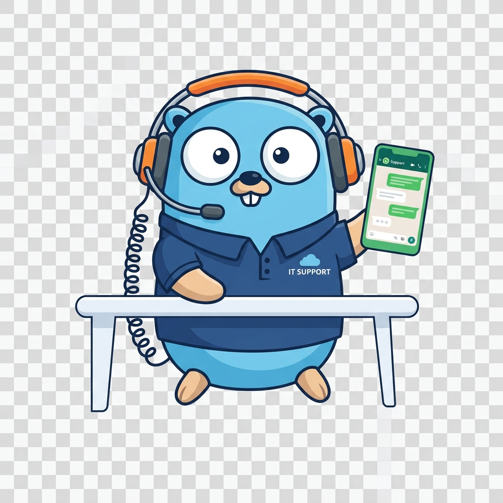
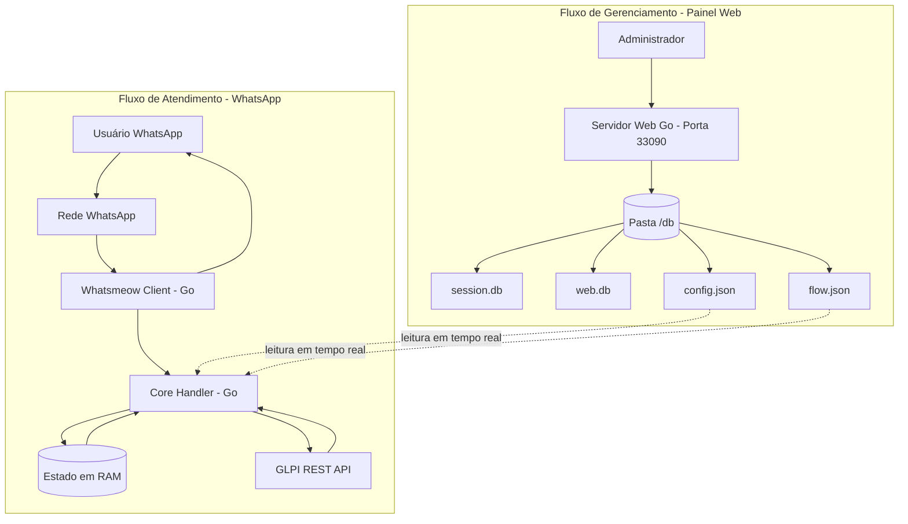
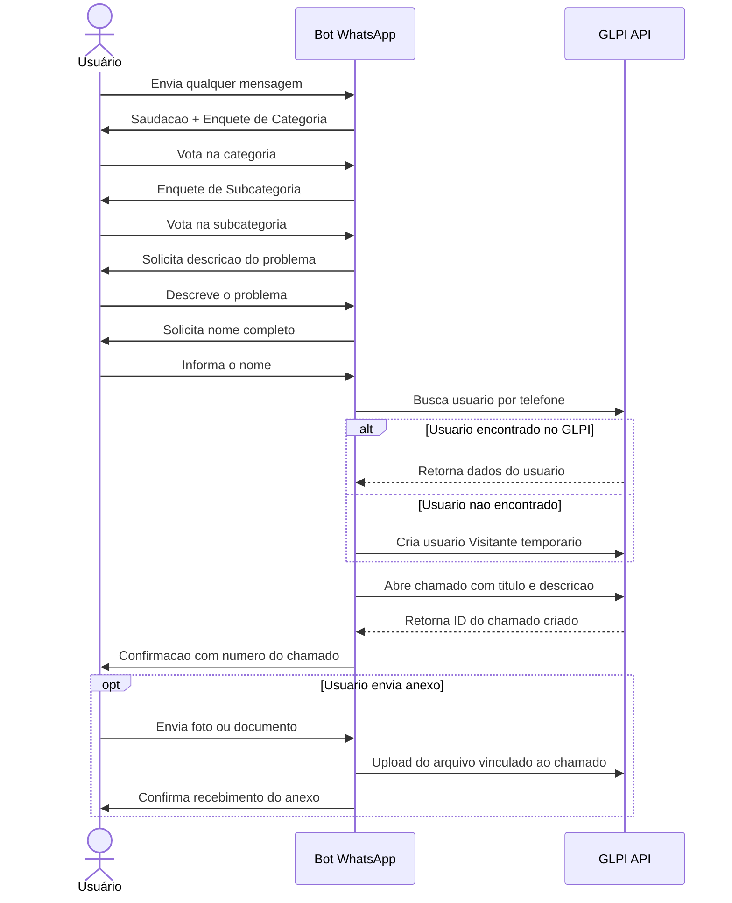

# WhatsApp Bot Pro — Integração GLPI



Bot de WhatsApp profissional desenvolvido em **Go**, integrado nativamente ao **GLPI via REST API**. Realiza triagem automática de chamados de TI por enquetes nativas do WhatsApp e disponibiliza um **Painel Web** para configuração dinâmica do fluxo de atendimento.

<br clear="both">

<p align="center">
  
  
  
  
</p>

---

## 🏗️ Arquitetura do Sistema



- **Fluxo de Atendimento**: O usuário interage pelo WhatsApp. O `Core Handler` em Go processa os eventos, mantém o estado em memória e se comunica com o GLPI para registrar chamados.
- **Fluxo de Gerenciamento**: O administrador acessa o painel web na porta `33090`. Configurações gravadas no diretório `/db` são aplicadas dinamicamente, sem reiniciar o container.

---

## 💬 Fluxo de Mensagens do Bot



---

## 🚀 Como Usar — Passo a Passo

<p align="center">
  
</p>

### Pré-requisitos

- Docker e Docker Compose instalados no servidor
- Instância do GLPI acessível com a REST API habilitada

---

### Passo 1 — Criar a pasta e o `docker-compose.yml`

```bash
mkdir glpi-bot && cd glpi-bot
```

Crie o arquivo `docker-compose.yml`:

```yaml
services:
  bot:
    image: ghcr.io/arthurjaexiste/glpi-bot:latest
    container_name: glpi-bot
    restart: unless-stopped
    ports:
      - "33090:33090"
    volumes:
      - ./db:/app/db
```

---

### Passo 2 — Iniciar o bot

```bash
docker compose up -d
```

O Docker baixará automaticamente a imagem pré-compilada do GHCR.

---

### Passo 3 — Acessar o Painel Web

Abra no navegador: **`http://localhost:33090`** (ou o IP do servidor).

Credenciais padrão:
- **Usuário:** `admin`
- **Senha:** `admin123`

---

### Passo 4 — Conectar o WhatsApp

Na aba **Status**, escaneie o QR Code com o WhatsApp:

> **WhatsApp → Configurações → Dispositivos conectados → Conectar um dispositivo**

---

### Passo 5 — Configurar a integração com o GLPI

Na aba **Configurações**, preencha os campos e clique em **Salvar**:

| Campo | Descrição |
|---|---|
| `URL da API GLPI` | Ex: `https://glpi.empresa.com/apirest.php` |
| `App Token` | Token de aplicação gerado no GLPI |
| `User Token` | Token do usuário operador do bot |
| `Nome da Empresa` | Exibido nas mensagens automáticas |
| `Telefone de Alerta` | Número para notificações críticas |
| `Atendentes` | Lista de técnicos separados por vírgula |

As configurações entram em vigor imediatamente, sem reiniciar o container.

---

### Passo 6 — Personalizar o Fluxo de Atendimento

Na aba **Fluxo**, use o construtor visual para adicionar, renomear ou remover categorias. As alterações são aplicadas em tempo real.

---

### Passo 7 — Personalizar as Mensagens

Na aba **Mensagens**, edite os textos com as variáveis disponíveis:

| Variável | Substituído por |
|---|---|
| `{saudacao}` | Bom dia / Boa tarde / Boa noite |
| `{empresa}` | Nome da empresa configurado |
| `{ticket_id}` | Número do chamado aberto no GLPI |
| `{nome}` | Nome informado pelo usuário |

---

## ⚡ Deploy Automático via GitHub Actions

O projeto possui o workflow `.github/workflows/docker-publish.yml`. A cada push na branch `main`, uma imagem Docker é compilada e publicada automaticamente no **GitHub Container Registry (GHCR)**.

---

## 🛠️ Tecnologias Utilizadas

| Tecnologia | Biblioteca | Função no Projeto |
| :--- | :--- | :--- |
| **Go (Golang)** | `golang.org` | Linguagem principal. Alta performance, baixo consumo de memória e binário estático único. |
| **Whatsmeow** | `go.mau.fi/whatsmeow` | Protocolo de conexão Multi-Device criptografada com o WhatsApp. |
| **SQLite (Pure Go)** | `modernc.org/sqlite` | Banco embarcado para sessões WhatsApp e credenciais do painel. Sem CGO. |
| **Tailwind CSS** | `tailwindcss.com` CDN | Interface visual moderna e responsiva do Painel Web. |
| **HTML5 + Vanilla JS** | Nativo | Telas administrativas e construtor de árvore de decisão. |
| **GLPI REST API** | GLPI | Busca de usuários, abertura de chamados e upload de anexos. |
| **Docker + Compose** | `docker.com` | Containerização e distribuição da aplicação. |
| **GitHub Actions** | CI/CD | Build e publicação automática no GHCR a cada push na `main`. |
| **x/text/unicode** | `golang.org/x/text` | Normalização NFC/NFD para compatibilidade de enquetes em iOS/macOS. |

---

## 🎯 Funcionalidades

### 1. Triagem por WhatsApp Polls
O bot guia o usuário pela árvore de decisão usando **enquetes nativas do WhatsApp**. O usuário apenas clica na opção, eliminando erros de digitação.

### 2. Abertura Completa de Chamados no GLPI
- **Associação Automática**: Busca o remetente no GLPI por telefone. Se não existir, cria um usuário Visitante temporário.
- **Anexos**: Fotos, PDFs, DOCX e XLSX são vinculados diretamente ao chamado.

### 3. Compatibilidade iOS/macOS
Normalização Unicode (NFC/NFD) em tempo real evita que respostas de iPhones e Macs com caracteres acentuados decompostos sejam ignoradas.

### 4. Bloqueio em Chamados Finalizados
Chamados **Solucionados** ou **Fechados** bloqueiam novas interações e orientam o usuário a abrir um novo chamado.

### 5. Painel Administrativo Web

| Aba | Função |
|---|---|
| **Status** | Conexão em tempo real com WhatsApp e QR Code dinâmico |
| **Fluxo** | Editor visual da árvore de decisão |
| **Configurações** | Chaves GLPI, telefone de alerta e lista negra |
| **Mensagens** | Personalização de textos com variáveis dinâmicas |

---

## 🛡️ Resiliência e Segurança

- **Mutex (`sync.RWMutex`)**: Protege leituras e escritas concorrentes no estado em memória, evitando race conditions.
- **Graceful Shutdown**: Sinais `SIGTERM`/`SIGINT` encerram conexões e sessões de forma limpa.
- **Auto-Reconnect**: O Whatsmeow reconecta automaticamente em caso de instabilidade de rede.
