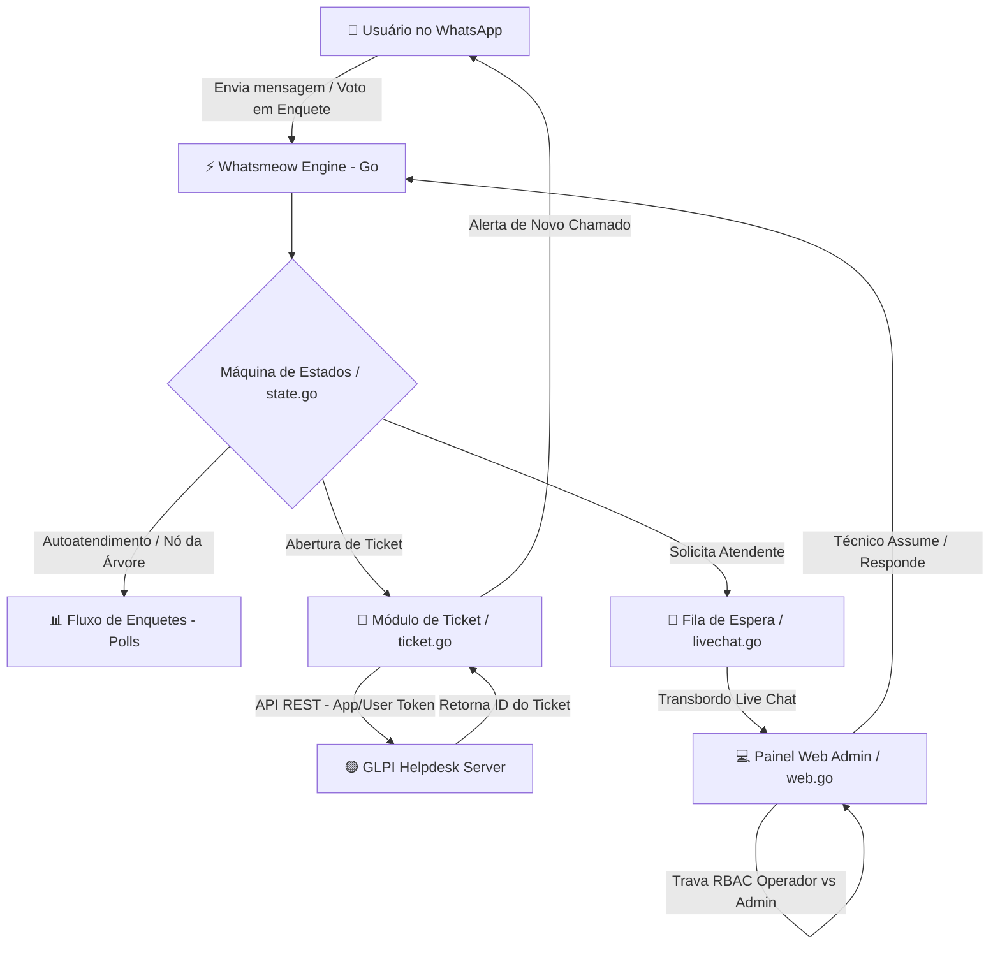

<p align="center">
  
</p>

<h1 align="center">🤖 GLPI-BOT | WhatsApp Automation & Multi-Agent Web Admin Panel</h1>

<p align="center">
  <b>Ecossistema Enterprise de Atendimento e Automação de Suporte Técnico via WhatsApp integrado ao GLPI Helpdesk.</b>
</p>

<p align="center">
  <a href="#-visão-geral"></a>
  <a href="#-instalação-e-execução-via-docker"></a>
  <a href="#-integração-com-glpi"></a>
  <a href="#-página-5-live-chat--gestão-multi-atendente"></a>
  <a href="#-segurança-rbac--gestão-de-mídias"></a>
</p>

---

## 📌 Sumário Completo

1. [📖 Visão Geral & Proposta de Valor](#-visão-geral)
2. [🏗️ Arquitetura do Sistema & Diagramas de Fluxo](#️-arquitetura-do-sistema--diagramas-de-fluxo)
3. [📂 Estrutura de Diretórios Detalhada](#-estrutura-de-diretórios-detalhada)
4. [🖥️ Mapeamento Completo das Páginas do Painel Web](#️-mapeamento-completo-das-páginas-do-painel-web)
   - [📊 Página 1: Status & Conexão WhatsApp](#-página-1-status--conexão-whatsapp)
   - [🔀 Página 2: Fluxo do Bot & Visual Flow Builder](#-página-2-fluxo-do-bot--visual-flow-builder)
   - [⚙️ Página 3: Configurações Gerais & Parâmetros GLPI](#-página-3-configurações-gerais--parâmetros-glpi)
   - [✉️ Página 4: Central de Mensagens & Templates Dinâmicos](#-página-4-central-de-mensagens--templates-dinâmicos)
   - [💬 Página 5: Live Chat & Gestão Multi-Atendente](#-página-5-live-chat--gestão-multi-atendente)
   - [👥 Página 6: Gestão de Usuários & RBAC](#-página-6-gestão-de-usuários--rbac)
   - [📋 Página 7: Logs Operacionais & Auditoria](#-página-7-logs-operacionais--auditoria)
5. [🔑 Requisitos & Integração Passo a Passo com o GLPI](#-requisitos--integração-passo-a-passo-com-o-glpi)
6. [🚀 Instalação e Execução via Docker Compose](#-instalação-e-execução-via-docker-compose)
7. [💻 Execução Nativa / Compilação Manual (Go)](#-execução-nativa--compilação-manual-go)
8. [📡 Documentação das APIs REST Internas](#-documentação-das-apis-rest-internas)
9. [🛡️ Segurança, RBAC & Gestão de Mídias Zero-Disk](#️-segurança-rbac--gestão-de-mídias-zero-disk)
10. [🛠️ Resolução de Problemas Comuns (Troubleshooting)](#️-resolução-de-problemas-comuns-troubleshooting)
11. [📄 Licença e Contribuição](#-licença-e-contribuição)

---

## 📖 Visão Geral & Proposta de Valor

O **GLPI-BOT** foi construído a partir do zero em **Go (Golang)** para resolver os gargalos de atendimento inicial e suporte N1/N2 em TI. Ele integra a API nativa do **whatsmeow** (protocolo WhatsApp Multi-Device) ao webservice do **GLPI Helpdesk**.

### 💥 Principais Problemas Resolvidos:
- **Erros de Digitação do Usuário:** Eliminados através da utilização de **Enquetes Nativas do WhatsApp (Polls)** em vez de menus de texto legados.
- **Abertura de Chamados Sem Vínculo:** O bot consulta o número do remetente no GLPI e atribui o ticket diretamente ao colaborador correto.
- **Conflito de Atendentes:** Sistema de **trava exclusiva de atendimento por técnico**, impedindo que dois operadores respondam ou assumam o mesmo cliente simultaneamente.
- **Acúmulo de Mídias em Disco:** Mecanismo **Zero-Disk Media** que converte imagens, áudios e arquivos em Base64 no SQLite e executa limpeza autônoma a cada 6 horas (retenção configurável de 7 dias com `VACUUM`).

---

## 🏗️ Arquitetura do Sistema & Diagramas de Fluxo



---

## 📂 Estrutura de Diretórios Detalhada

```
GLPI-BOT/
├── cmd/
│   └── bot/
│       └── main.go                 # Ponto de entrada da aplicação, inicialização de rotinas e servidores
├── internal/
│   ├── config/
│   │   └── config.go               # Definição do schema de configurações, migração e persistência JSON
│   ├── glpi/
│   │   └── glpi.go                 # Cliente HTTP REST para abertura de chamados, busca de colaboradores e anexos
│   ├── state/
│   │   └── state.go                # Estado global thread-safe com mapa ActiveLiveChats por número de cliente
│   └── whatsapp/
│       ├── flow.go                 # Processador da árvore visual de navegação e nós de enquetes
│       ├── handler.go              # Listener principal do Whatsmeow (recebimento de texto, mídia, ausência)
│       ├── livechat.go             # Fila de espera, transbordo e gerenciamento de atendentes ativos
│       ├── polls.go                # Utilitários de criação e casamento de hashs de enquetes nativas
│       ├── smtp.go                 # Monitor da saúde da aplicação que envia e-mails em caso de desconexão
│       ├── ticket.go               # Coleta estruturada de título, descrição, fotos e documentos
│       ├── utils.go                # Sanitização de JID, citação de respostas (extrairInfoCitada) e utilitários
│       └── web.go                  # Servidor HTTP nativo com endpoints REST JSON, sessão e controle RBAC
├── static/                         # Ativos de frontend (CSS estilizado, JS reativo, logos, PWA)
├── web/                            # Páginas HTML do painel administrativo
├── Dockerfile                      # Dockerfile multi-stage otimizado
├── docker-compose.yml              # Arquivo de execução e orquestração simplificada
├── go.mod                          # Arquivo de dependências do módulo Go
└── README.md                       # Documentação mestre completa
```

---

## 🖥️ Mapeamento Completo das Páginas do Painel Web

O painel administrativo é uma **Single/Multi-Page Application moderna** construída com HTML5, Vanilla JavaScript de alta velocidade e TailwindCSS, sem a necessidade de frameworks pesados.

---

### 📊 Página 1: Status & Conexão WhatsApp
* **Conexão via QR Code:** Exibe o QR Code dinâmico gerado pelo `whatsmeow` para conexão direta com o número corporativo.
* **Indicadores de Saúde:** Status do serviço em tempo real (Conectado / Desconectado / Reconectando).
* **Métricas Principais:** Quantidade de atendimentos em andamento, fila de espera atual e total de chamados abertos no dia.
* **Ações Rápidas:** Botões para **Conectar**, **Desconectar** ou **Reiniciar a Engine**.

---

### 🔀 Página 2: Fluxo do Bot & Visual Flow Builder
* **Nós da Árvore de Navegação:** Interface para adicionar, editar ou remover opções do menu do bot.
* **Integração com Enquetes Nativas:** Cada opção configurada no painel é automaticamente convertida em um botão clicável de enquete no WhatsApp do usuário.
* **Nó "Voltar ao Menu":** Configuração de botões de retorno inteligente ao nó pai.
* **Abertura de Ticket Direta:** Vinculação de categorias do menu com a abertura direta de chamados.

---

### ⚙️ Página 3: Configurações Gerais & Parâmetros GLPI
* **Conexão GLPI:** Configuração da URL da API REST (ex: `https://suporte.empresa.com.br/apirest.php`), **App-Token** e **User-Token**.
* **Controle de Expediente:** Definição de horário de início/fim e dias da semana em que o suporte funciona.
* **Mensagem de Ausência:** Texto personalizado entregue aos usuários que entrarem em contato fora do horário comercial.
* **Configuração SMTP:** Parâmetros de servidor de e-mail (Host, Porta, Usuário, Senha) para envio de alertas em caso de desconexão.

---

### ✉️ Página 4: Central de Mensagens & Templates Dinâmicos
* **Templates Customizáveis:** Edição de todas as mensagens automáticas enviadas pelo robô.
* **Variáveis Dinâmicas Suportadas:**
  - `{nome}`: Nome do colaborador/contato.
  - `{posicao}`: Posição atual na fila de espera do suporte.
  - `{agente}`: Nome do técnico responsável pelo atendimento.
  - `{ticket_id}`: Número do chamado gerado no GLPI.
  - `{titulo}`: Título resumido do chamado.

---

### 💬 Página 5: Live Chat & Gestão Multi-Atendente
* **Interface Estilo WhatsApp Web:** Visual escuro (Dark Mode) moderno com histórico completo de mensagens.
* **Identificação com Bloco de Citação Nativo (`> 👨‍💻 *Nome:*`)**: As mensagens entregues ao celular do cliente chegam formatadas com o cabeçalho do técnico em bloco de citação do WhatsApp, enquanto o painel exibe o histórico limpo e sem poluidores.
* **Mensagens Citadas (Reply Quote)**: Exibição dos cartões de resposta citada dentro das bolhas do chat com o nome do autor resolvido (`extrairInfoCitada`).
* **Trava Exclusiva por Técnico**:
  - Quando o técnico **Arthur da Silva Salles** assume um atendimento, a caixa de entrada de outros operadores fica **bloqueada** (`🔒 Atendimento exclusivo do técnico: Arthur da Silva Salles`), ocultando o botão `✓ Finalizar`.
  - Administradores (`admin`) possuem permissão especial para visualizar, responder e encerrar qualquer conversa a qualquer momento.

---

### 👥 Página 6: Gestão de Usuários & RBAC
* **Controle de Acesso Baseado em Papéis (RBAC)**:
  - **Administrador (`role: admin`)**: Acesso total ao painel, configurações, usuários, logs e capacidade de intervir/finalizar qualquer atendimento humano.
  - **Operador (`role: operator`)**: Acesso restrito às conversas e ao módulo de Live Chat, respeitando a trava de exclusividade do técnico atribuído.
* **CRUD Completo:** Criação, edição de nome, alteração de senha e ativação/desativação de contas de acesso ao painel.

---

### 📋 Página 7: Logs Operacionais & Auditoria
* **Console de Logs em Tempo Real:** Acompanhamento de todas as requisições HTTP, eventos do WhatsApp, erros de API do GLPI e ações de atendentes.
* **Filtros e Busca:** Busca rápida por nível de log (INFO, WARN, ERROR) e palavras-chave.

---

## 🔑 Requisitos & Integração Passo a Passo com o GLPI

A integração entre o **GLPI-BOT** e o seu servidor GLPI utiliza a **API REST nativa**.

### 1. Habilitar a API REST no GLPI:
1. Acesse o GLPI com uma conta de Administrador.
2. Vá em **Configurar > Geral > API**.
3. Marque a opção **Habilitar API Rest** como `Sim`.
4. Habilite **Habilitar login com credenciais de usuário** como `Sim`.
5. Em **Clientes API**, clique em `+ Adicionar`, preencha o nome (ex: `GLPI-BOT`) e adicione o IP do servidor onde o bot rodará (ou deixe em branco para permitir qualquer IP).
6. Copie o **App-Token** gerado.

### 2. Gerar o User-Token:
1. Acesse as preferências do usuário no GLPI (recomendado criar um usuário exclusivo para a automação, ex: `bot.whatsapp`).
2. Acesse a aba **Chaves de acesso remoto** (Remote Access Keys).
3. Clique em **Gerar chave API** para obter o **User-Token**.

### 3. Permissões Necessárias no Perfil GLPI:
Garantir que o perfil associado ao usuário do bot no GLPI possua as seguintes permissões:
* **Usuários:** `Leitura` (para pesquisar o solicitante pelo número de telefone).
* **Chamados:** `Criar` e `Atualizar` (para criar tickets e inserir acompanhamentos).
* **Documentos:** `Criar` (para anexo de fotos e arquivos).

---

## 🚀 Instalação e Execução via Docker Compose

### Arquivo `docker-compose.yml`

```yaml
version: "3.8"

services:
  glpi-bot:
    image: ghcr.io/arthurjaexiste/glpi-bot:latest
    container_name: glpi-bot
    restart: unless-stopped
    ports:
      - "33090:33090"
    volumes:
      - ./db:/app/db
      - ./config:/app/config
    environment:
      - TZ=America/Sao_Paulo
```

### Inicializando o serviço:
```bash
docker compose up -d
```

### Acompanhar logs de execução:
```bash
docker compose logs -f glpi-bot
```

---

## 💻 Execução Nativa / Compilação Manual (Go)

Caso deseje executar ou compilar o projeto diretamente a partir do código fonte:

### Pré-requisitos:
* Go 1.22 ou superior
* GCC / Cgo habilitado (para compilação do SQLite)

### Passos:
```bash
# 1. Clonar o repositório
git clone https://github.com/arthurjaexiste/GLPI-BOT.git
cd GLPI-BOT

# 2. Baixar as dependências
go mod download

# 3. Compilar a aplicação
go build -o bot cmd/bot/main.go

# 4. Executar o binário gerado
./bot
```

---

## 📡 Documentação das APIs REST Internas

O painel administrativo expõe endpoints JSON protegidos por autenticação de sessão:

| Método | Endpoint | Descrição | Permissão |
| :--- | :--- | :--- | :--- |
| `GET` | `/api/me` | Retorna dados do usuário autenticado na sessão | Autenticado |
| `GET` | `/api/chats` | Lista conversas ativas, últimos snippets e status | Autenticado |
| `GET` | `/api/chats/messages` | Carrega o histórico de mensagens de um chat especifico | Autenticado |
| `POST` | `/api/chats/send` | Envia mensagem de texto para o cliente no WhatsApp | Atribuído / Admin |
| `POST` | `/api/chats/send-media` | Envia imagens, documentos ou áudios de voz em Base64 | Atribuído / Admin |
| `POST` | `/api/chats/assume` | Assume o atendimento de uma conversa da fila | Operador / Admin |
| `POST` | `/api/chats/close` | Finaliza o atendimento humano e reativa o bot | Atribuído / Admin |
| `DELETE`| `/api/chats/delete` | Apaga o histórico de mensagens de uma conversa | Autenticado |
| `GET` | `/api/users` | Lista usuários do sistema web | Apenas Admin |
| `POST` | `/api/users` | Cria ou edita um usuário do sistema | Apenas Admin |
| `DELETE`| `/api/users/delete` | Exclui um usuário do sistema | Apenas Admin |

---

## 🛡️ Segurança, RBAC & Gestão de Mídias Zero-Disk

### 🔒 Segurança e Isolamento de Sessão (RBAC):
- O sistema utiliza **cookies de sessão seguros com identificador randômico de 32 bytes (Crypto/Rand)**.
- Operadores não conseguem interferir em conversas atribuídas a outros técnicos a menos que possuam o papel `admin`.

### 🧹 Gestão de Mídias Zero-Disk:
- Mídias enviadas e recebidas são convertidas em **Base64 Data URLs** e armazenadas diretamente no SQLite.
- A cada 6 horas, um daemon executa em background:
  - Remove mídias Base64 com mais de 7 dias da tabela `chat_messages`.
  - Exclui arquivos temporários residuais do diretório `static/uploads/`.
  - Executa a instrução `VACUUM` no SQLite para liberar espaço físico em disco de forma transparente.

---

## 🛠️ Resolução de Problemas Comuns (Troubleshooting)

### 1. O QR Code não carrega no painel
- Verifique se a porta `33090` está aberta no firewall do servidor.
- Caso o estado do Whatsmeow fique preso, clique em **Reiniciar Bot** no painel de configurações para limpar a sessão em memória e gerar um novo QR Code.

### 2. Chamados abertos como "Usuário Anônimo"
- Certifique-se de que o número do WhatsApp do solicitante está cadastrado no campo **Telefone** ou **Celular** do usuário correspondente dentro do GLPI.
- O formato do telefone no GLPI deve ser informado no padrão internacional sem símbolos de adição (ex: `5575999999999`).

### 3. As mídias enviadas pelo painel não chegam ao WhatsApp do cliente
- Verifique se o formato do arquivo é suportado (Imagens: JPG, PNG, WEBP; Áudios: OGG, MP3; Documentos: PDF, DOCX, XLSX, TXT, ZIP).
- Verifique nos logs se a conexão com os servidores do WhatsApp CDN está ativa.

---

## 📄 Licença e Contribuição

Este projeto é distribuído sob a licença **MIT**. Sinta-se à vontade para contribuir com Pull Requests, reportar Issues ou sugerir novas funcionalidades.

<p align="center">
  Desenvolvido com ❤️ por <b>Arthur Salles</b>
</p>
